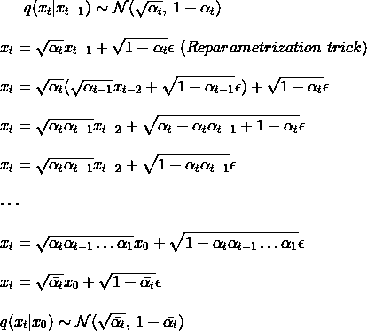
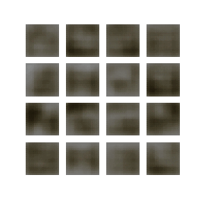

# Image generative models

## cDCGAN

* [GAN — Why is it hard to train GANs ?](https://jonathan-hui.medium.com/gan-why-it-is-so-hard-to-train-generative-advisory-networks-819a86b3750b)
* [cGAN — What's a cGAN ?](https://datascientest.com/conditional-generative-adversarial-network-cgan)

### Results (200 epochs)

## Diffusion Model

* Forward Process

* [Backward Process Mathematics](https://youtu.be/HoKDTa5jHvg?t=819)
* [Diffusion model from sratch (Pytorch)](https://youtu.be/a4Yfz2FxXiY)
* [How DALL-E 2 works ?](https://www.assemblyai.com/blog/how-dall-e-2-actually-works/)

## Variational Autoencoder

* [The Reparameterization Trick](https://www.baeldung.com/cs/vae-reparameterization)
* [Kullback–Leibler divergence](https://en.wikipedia.org/wiki/Kullback%E2%80%93Leibler_divergence)
    * [DKL(P || Q) ≥ 0](https://stats.stackexchange.com/questions/335197/why-kl-divergence-is-non-negative)

### Results (100 epochs then no improvements)
